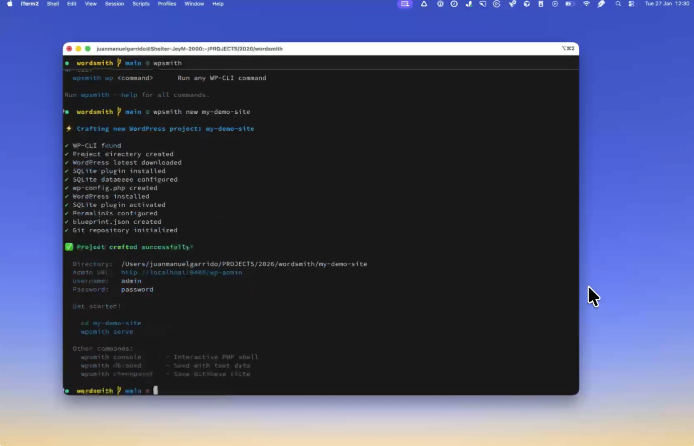

# ⚡ WPSmith

**The CLI for WordPress Wordsmiths** — Laravel-like WordPress development with Playground and SQLite.

## Why WPSmith?

Laravel developers love Artisan. WPSmith brings that same elegant developer experience to WordPress:

- **Instant setup** — Create a full WordPress project in seconds
- **SQLite by default** — No MySQL required, just files
- **Playground integration** — Run WordPress in WebAssembly
- **Checkpoints & rollback** — Save and restore database state
- **Interactive shell** — Like Laravel Tinker, but for WordPress
- **Forge commands** — Scaffold plugins, themes, blocks, and more

[](https://www.youtube.com/watch?v=bzCrTWyKnI8)

_See [video demo](https://www.youtube.com/watch?v=bzCrTWyKnI8)_

## Installation

```bash
npm install -g wpsmith
```

## Quick Start

```bash
# Create a new WordPress project
wpsmith new my-site

# Start the development server
cd my-site
wpsmith serve

# Open interactive PHP shell
wpsmith console
```

## Requirements

- **Node.js** >= 20.0.0
- **WP-CLI** installed and in PATH ([Install guide](https://wp-cli.org/#installing))

## Commands

### Project Management

```bash
wpsmith new [name]          # Create a new WordPress project
wpsmith serve               # Start development server (Playground)
wpsmith console              # Interactive PHP shell
wpsmith wp <command>        # Run any WP-CLI command
```

### Database

```bash
wpsmith db:fresh            # Reset database to fresh state
wpsmith db:fresh --seed     # Reset and seed with test data
wpsmith db:seed             # Seed with test data
wpsmith db:export [file]    # Export database to SQL file
wpsmith db:import <file>    # Import database from SQL file
```

### Checkpoints (Save/Restore State)

```bash
wpsmith checkpoint [name]   # Create a checkpoint
wpsmith checkpoint:list     # List all checkpoints
wpsmith rollback [name]     # Restore from checkpoint
wpsmith checkpoint:delete   # Delete a checkpoint
wpsmith checkpoint:clear    # Delete all checkpoints
```

### Forge (Scaffolding)

```bash
wpsmith forge:plugin <slug>       # Scaffold a new plugin
wpsmith forge:theme <slug>        # Scaffold a new theme
wpsmith forge:child-theme <slug>  # Scaffold a child theme
wpsmith forge:post-type <slug>    # Scaffold a custom post type
wpsmith forge:taxonomy <slug>     # Scaffold a custom taxonomy
wpsmith forge:block <slug>        # Scaffold a block
```

## Laravel Comparison

| Laravel                        | WPSmith                        |
| ------------------------------ | ------------------------------ |
| `composer create-project`      | `wpsmith new`                  |
| `php artisan serve`            | `wpsmith serve`                |
| `php artisan tinker`           | `wpsmith console`               |
| `php artisan migrate:fresh`    | `wpsmith db:fresh`             |
| `php artisan migrate:fresh --seed` | `wpsmith db:fresh --seed`  |
| `php artisan db:seed`          | `wpsmith db:seed`              |
| `php artisan make:model`       | `wpsmith forge:post-type`      |
| `php artisan make:controller`  | `wpsmith forge:plugin`         |
| `php artisan cache:clear`      | `wpsmith wp cache flush`       |

## Configuration

Projects use the standard [WordPress Playground Blueprint](https://wordpress.github.io/wordpress-playground/blueprints) format:

```json
{
  "$schema": "https://playground.wordpress.net/blueprint-schema.json",
  "preferredVersions": {
    "php": "8.3",
    "wp": "latest"
  },
  "steps": [
    {
      "step": "installPlugin",
      "pluginData": {
        "resource": "wordpress.org/plugins",
        "slug": "query-monitor"
      }
    }
  ],
  "wpsmith": {
    "port": 9400
  }
}
```

The `wpsmith` key is an extension for local dev settings. Everything else follows the standard Playground blueprint schema, giving you access to all blueprint features like themes, site options, and more.

## Custom Seeders

Create custom seeders in the `seeders/` directory:

```json
// seeders/demo.json
{
  "name": "Demo Seeder",
  "description": "Creates demo content for presentations",
  "steps": [
    { "command": "user create demo demo@example.com --role=editor --user_pass=demo", "description": "Create demo user" },
    { "command": "post generate --count=20", "description": "Generate posts" },
    { "command": "option update blogname 'Demo Site'", "description": "Set site name" }
  ]
}
```

Run with:

```bash
wpsmith db:seed --seeder=demo
```

## How It Works

WPSmith combines:

1. **WordPress Playground CLI** — Runs WordPress in WebAssembly, no server required
2. **SQLite Database Integration** — Stores data in a single file, perfect for development
3. **WP-CLI** — Powers all WordPress operations

The database is stored at `wp-content/database/.ht.sqlite`. Checkpoints are simply copies of this file, making rollback instant.

## Development

```bash
# Clone the repository
git clone https://github.com/juanmaguitar/wpsmith.git
cd wpsmith

# Install dependencies
npm install

# Build
npm run build

# Link for local testing
npm link

# Now you can use `wpsmith` globally
wpsmith --help
```

## License

MIT
